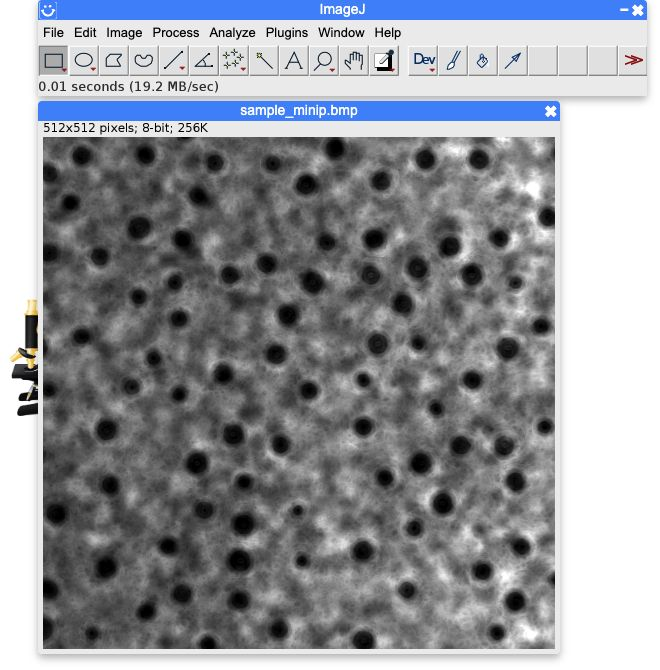
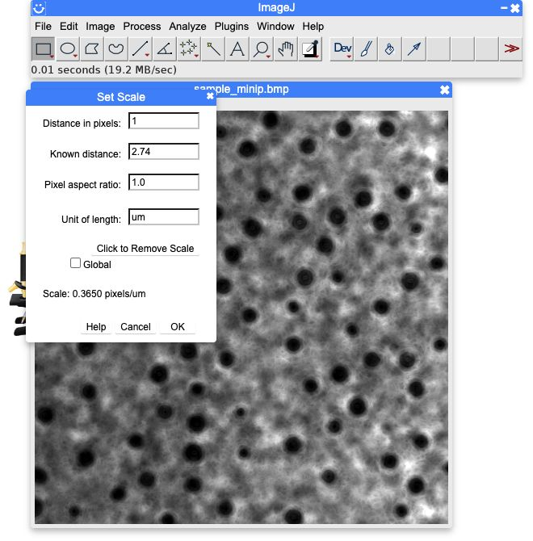
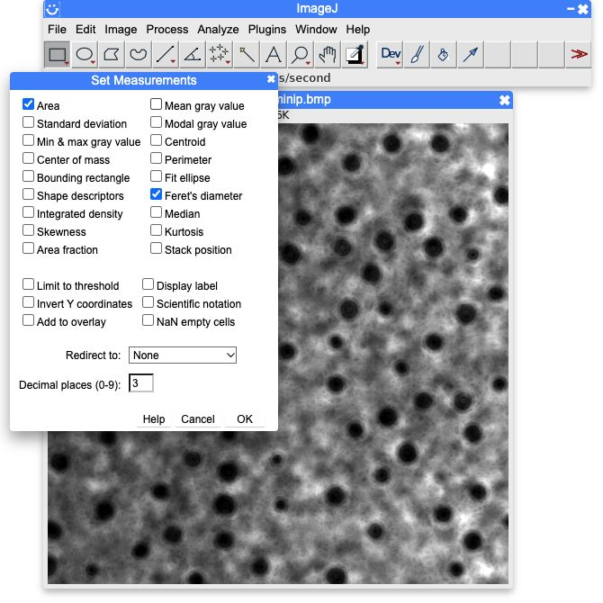
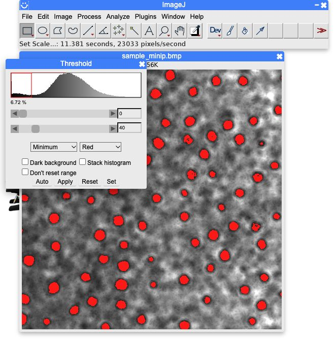
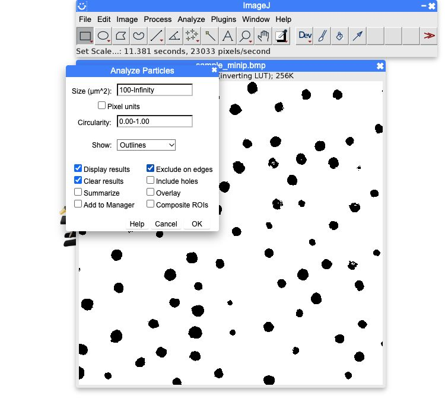
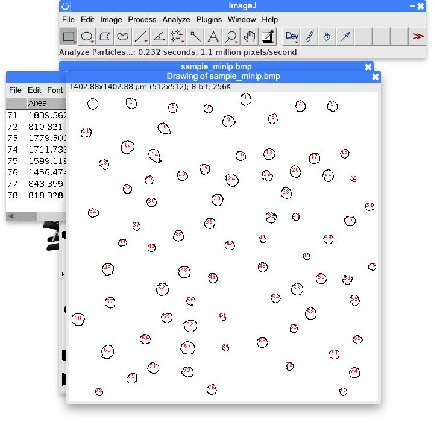
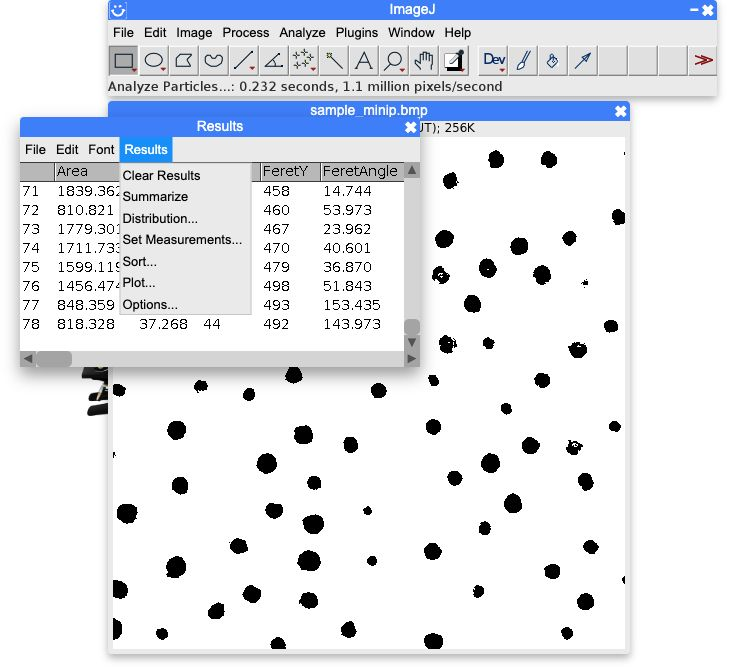
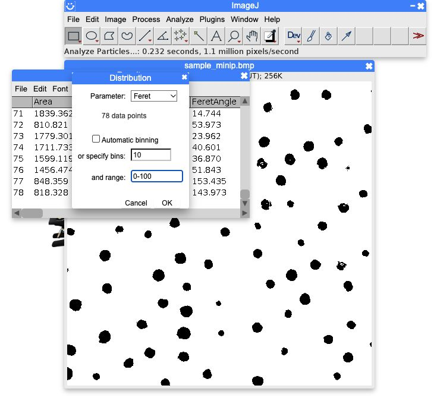
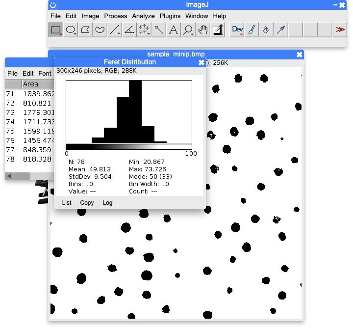

# ArcImgAcquisition / DualHolo

外部10 Hzトリガで2台のSpinnakerカメラを表示し、Rec中に受信した全画像を無圧縮TIFFへ保存するC++17アプリです。
カメラ設定は読み取り専用で、起動時はRec OFFです。

[配布アプリ](https://github.com/dainakai/ArcImgAcquisition/releases) / [ビルドと配布手順](260909/docs/distribution.md) / [操作と保存仕様](260909/README.md)

Windows x64、Linux x64、macOS arm64とx64をGitHub Actionsでビルドします。
`v*`タグのテスト成功後にReleaseへ配布アーカイブを登録します。
実カメラにはSpinnakerランタイムとドライバが必要で、模擬入力はSDKなしで動作します。

```sh
cmake -S 260909 -B 260909/build -DCMAKE_BUILD_TYPE=Release
cmake --build 260909/build --parallel 4
ctest --test-dir 260909/build --output-on-failure
```

ソースは `260909/src`、テストは `260909/tests` にあります。
同じリポジトリの [DualHolo Analyze](260909/analyzer/README.md) は、2台の画像のCapture、Gabor再生、Tamura焦点探索、キャリブレーションとGS位相回復に対応するCPU用GUIです。
連続撮影用のDualHoloとは別アプリです。[Analyzeの配布](https://github.com/dainakai/ArcImgAcquisition/releases/tag/analyzer-v0.6.0) は `analyzer-v*` タグで管理します。
カメラとSDKがなくても起動でき、保存済みのDualHolo画像を読み込めます。
ソースと配布用CIを `260909/analyzer` に置き、手順書用の小さなサンプルを除く撮影データ・解析結果と、SDK・ビルド出力はGitに含めません。

## MinIPから粒径分布を得る方法

DualHolo Analyzeの「MinIP」でモード（Gabor／PR）、奥行き範囲、間隔を指定し、「MinIPを作成」→「MinIPを保存」でBMPまたはPNGを保存します。
以下は、実測ドット板の[サンプル画像](260909/analyzer/docs/imagej-minip/sample_minip.bmp)を[ImageJ](https://ij.imjoy.io/)で計測する手順です。
サンプルはGaborで53〜55 mmを0.1 mm間隔で再構成したMinIPです。

[再構成条件](260909/analyzer/docs/imagej-minip/sample_minip.bmp.json) / [作成スクリプト](260909/analyzer/docs/make_minip_example.py) / [ImageJマクロ](260909/analyzer/docs/imagej-minip/measure_minip.ijm) / [結果CSV](260909/analyzer/docs/imagej-minip/Results.csv)

### 1. MinIPを開き、単位と測定項目を指定する

**File → Open...** でMinIP画像を開きます。
RGB画像の場合は **Image → Type → 8-bit** で変換します。



**Analyze → Set Scale...** を開き、サンプルでは **Distance in pixels: 1、Known distance: 2.74、Pixel aspect ratio: 1.0、Unit of length: um** としてOKを押します。



**Analyze → Set Measurements...** で **Area** と **Feret's diameter** にチェックを付け、OKを押します。
粒径には最大Feret径を使います。



### 2. 二値化する

**Image → Adjust → Threshold...** で画像に合う方法を選びます。おすすめは **Minimum** です。
サンプルでは **Minimum、Red、Dark background: OFF** とし、しきい値は **0〜40** になります。
赤い領域を確認して **Apply** を押し、Thresholdウィンドウを閉じます。



### 3. Analyze Particlesで粒子を計測する

**Analyze → Analyze Particles...** を開き、**Show: Outlines** を選びます。
**Display results** と **Clear results** にチェックを付けます。
サンプルでは **Size (µm²): 100-Infinity、Circularity: 0.00-1.00、Exclude on edges: ON** としてOKを押します。





### 4. Resultsから粒径分布を表示する

Resultsウィンドウの **Results → Distribution...** を開きます。



**Parameter** で見たい測定値を選び、OKを押します。
サンプルでは **Feret、Automatic binning: OFF、bins: 10、range: 0-100** とします。





計測数は78個、平均Feret径は49.813 µmです。
